# Task 10 - **Comprehensive Workflow with Forced Pushes and Recovery**

## **Objective :**
- Simulate an advanced Git scenario that includes forced pushes, recovering lost commits, and a multi-branch workflow.

## **Requirements :**
- Create a repository with multiple branches representing features, bug fixes, and releases.
- Simulate a scenario where a forced push (`git push --force`) is required.
- Use `git reflog` to locate and recover lost commits after a mistaken force push.
- Document each step, explaining how and why forced pushes should be handled with care, and how `git reflog` can be a lifesaver.
- Discuss best practices for collaborating with teams when rewriting history and using force pushes.

## **Implementation :**

### **1. Initialize a Local Git Repository:**
- Initialize the local project folder as a Git repository. 
- This sets up Git to start version control.

```sh
git init
```

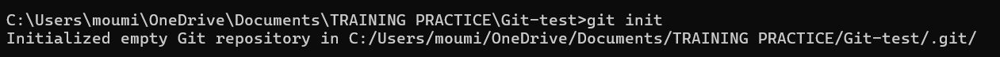

### **2. Link Remote Repository (GitHub):**
- Connect the local repository to a GitHub remote repository.

```sh
git remote add origin https://github.com/your-name/your-repo-name.git
```
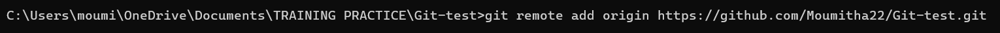

### **3. Rename Default Branch:**
- Rename the default branch from master to main (as followed by modern Git standards).

```sh
git branch -M main
```

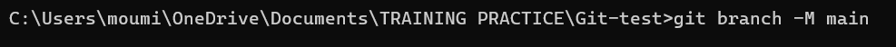

### **4. Create and Commit files in the `main` branch:**
- Create a basic contact.html file.
- Stage and commit the file to Git.

```sh
git echo "Content" > file_name
git add file_name
git commit -m "Commit message"
```
 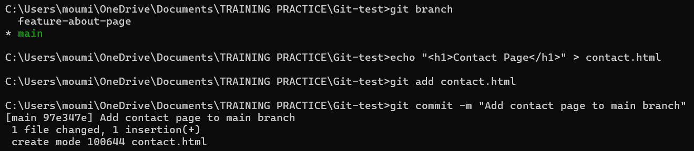

### **5. Create feature-gallery, bugfix-contact and release-v1.0 Branches:**

```sh
git checkout -b <branch-name>
```

- Create a new branch `feature-gallery` to add the gallery feature.

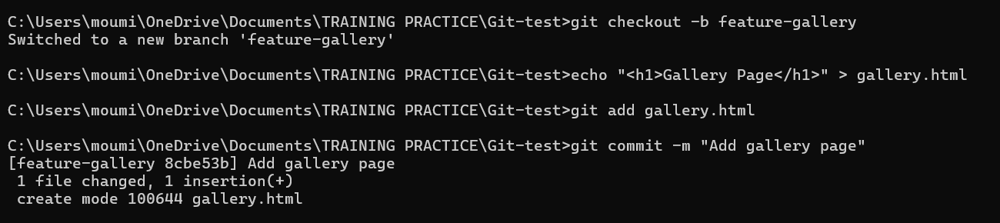

- Create a `bugfix-contact` branch to fix a typo in contact.html.

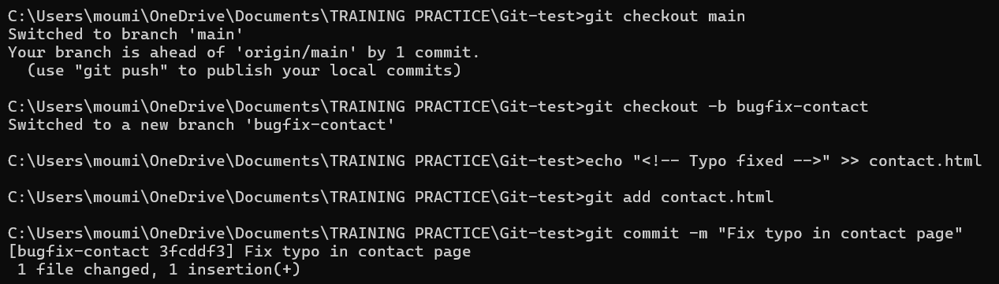

- Create a `release-v1.0` branch to prepare for release.

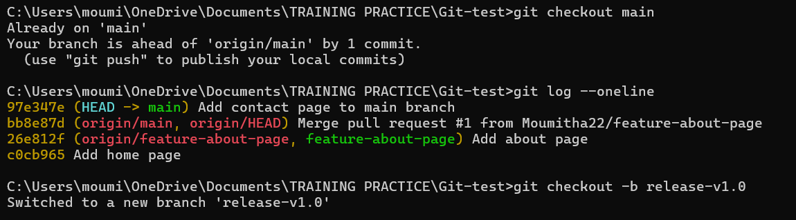


### **6. Push all branches to remote:**
- Push main, feature-gallery, bugfix-contact, and release-v1.0 to remote.

```sh
git push origin <branch-name>
```

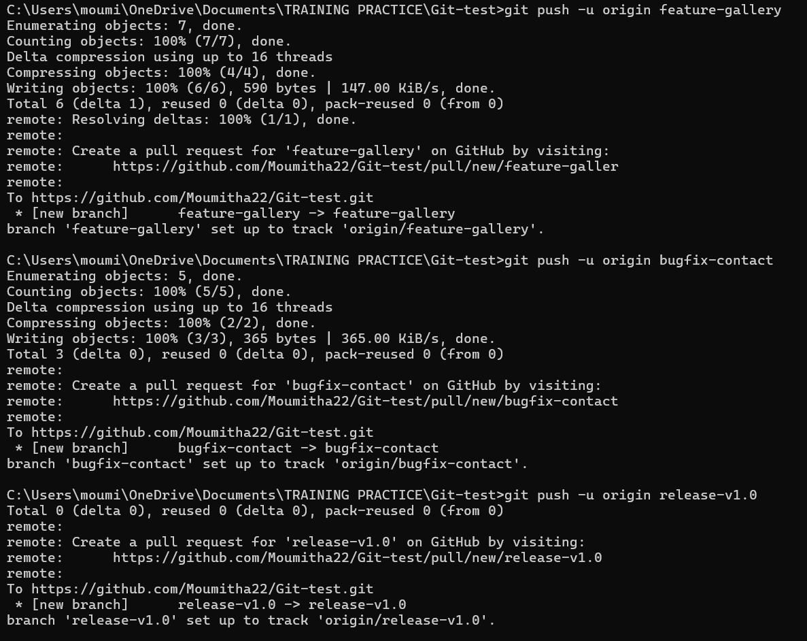

### **7. Checkout to feature-gallery Branch and Rebase**
- Use an interactive rebase to change commit messages or squash commits.
- This rewrites history, so it will require a force push later.

```sh
git rebase -i HEAD~1
```

- Checkout to feature-gallery and use an interactive rebase to reword commit mesage.

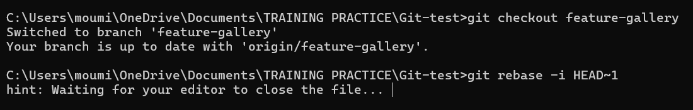

- Choose `reword `in editor and proceed to start rebase.
- Give the new commit message and close the file in the editor.

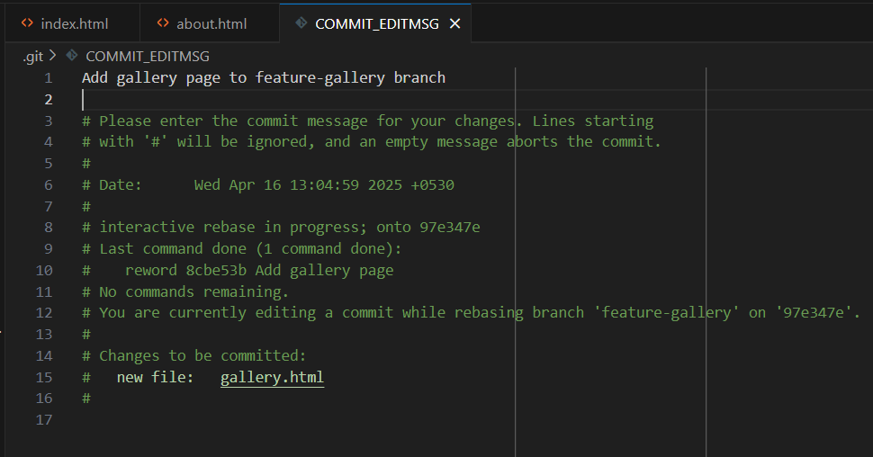

- Check the log after rebase.

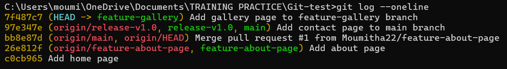

- The commit message has been successfully updated.


### **8. Force Push After Rebase:**
- Since history was rewritten, a normal push fails.
- `--force` is used to overwrite the remote branch with the new history.

```sh
git push --force
```

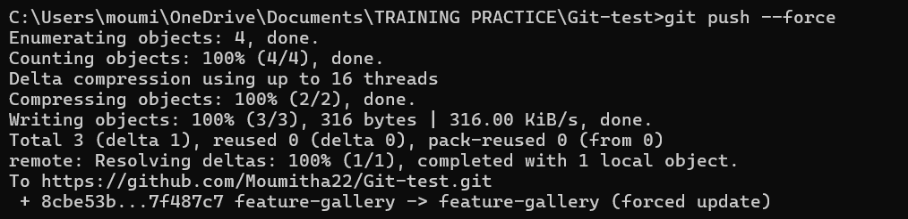


***Note :***
- Force pushing is dangerous because it can overwrite others' work. It should only be used:
    - On your own branches
    - When you're certain no one else is working on the same branch
    - After coordinating with your team


### **9. Simulate Mistaken Reset :**
- Reset the branch to a previous commit.
- Resetting to a previous commit removes the latest commit locally (simulating a mistake).

```sh
git reset --hard HEAD~1 
```


- Check kog after reset.

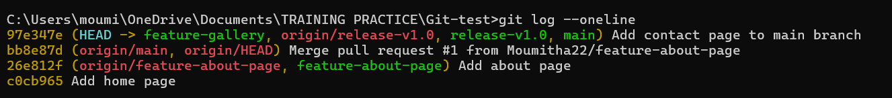

- Now the last commit is lost from git log — but not permanently.


### **10. Recover Lost Commit Using `git reflog`**
- `git reflog` tracks all actions, including resets.
- Use it to find the lost commit's hash.

```sh
git reflog
```

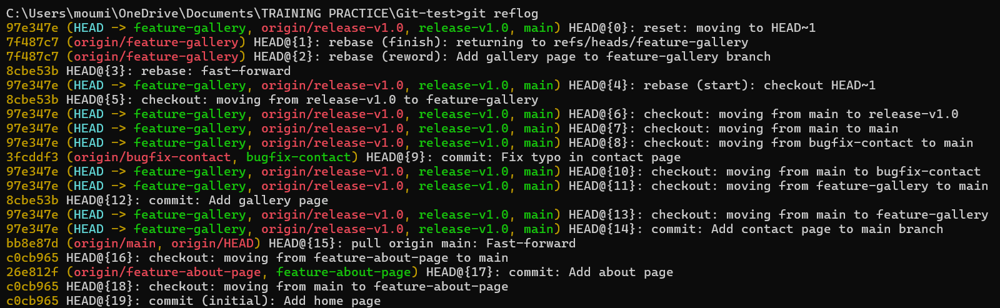


### **11. Restore lost commit:**
- After finding the correct commit hash from the reflog, we can use it to bring the lost commit back into the branch history.
- Reset back to the lost commit using its hash from the reflog and push again.

```sh
git reset --hard <commit_hash>
git push --force
```


- Check log after reset.

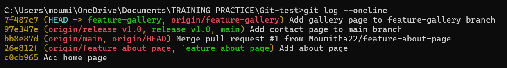

- The commit has been successfully restored and is now part of the branch history.


### **Why git reflog is a Lifesaver?**
In our example, after mistakenly running:

```sh
git reset --hard HEAD~1
```

- We lost the gallery commit. 
- `git reflog` tracked the position of HEAD before and after the rebase, letting us recover the commit.


### **Best Practices for Force Pushes:**
- Avoid force pushing to shared branches like main or release
- Always double-check your changes before using --force
- Use git reflog to recover lost commits if mistakes happen
- Communicate with your team before rewriting history
- Prefer --force-with-lease over --force for safer operations
