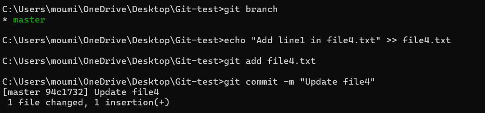
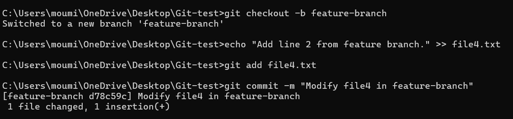
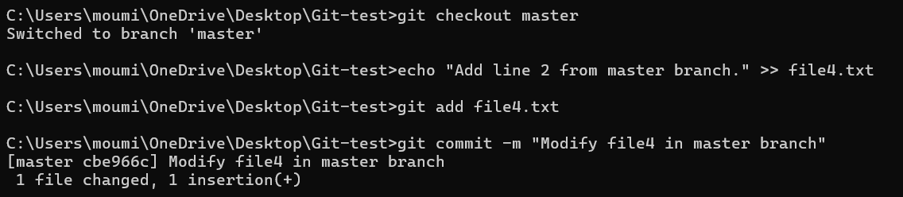
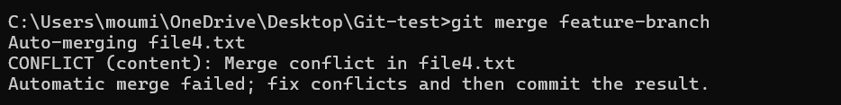
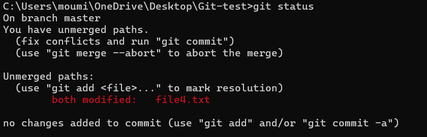
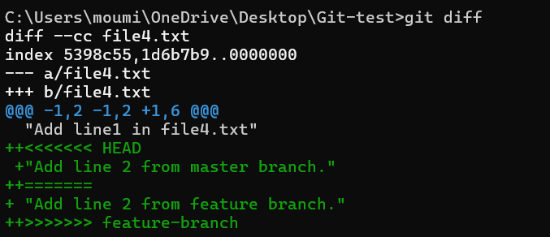
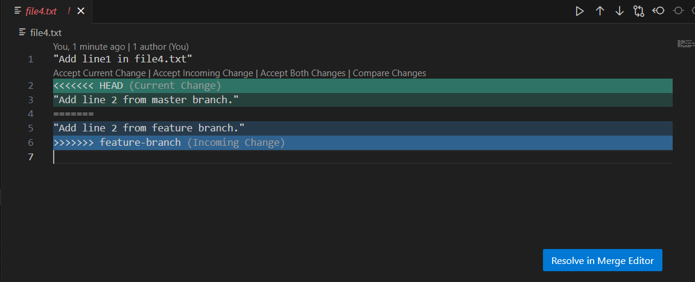
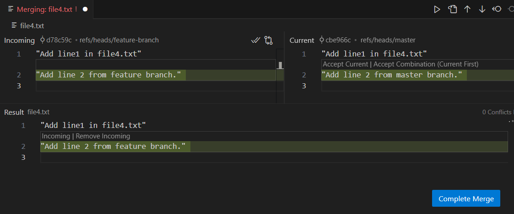
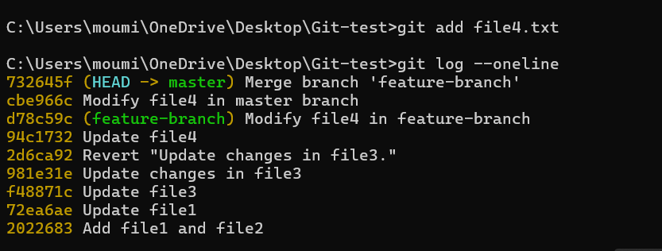

# Task-4 Simulating and Resolving Merge Conflicts

## Objectives:
- Create a scenario that produces a merge conflict and resolve it.

## Requirements
- Create two branches from the same commit.
- Modify the same line(s) of code in a common file in both branches.
- Attempt to merge the branches, observe the conflict, and resolve it manually.
- Use `git status` and `git diff` to identify and resolve the conflicting changes.

## Steps to Simulate and Resolve Merge Conflicts:

#### 1. Create a File and Make an Initial Commit:

#### 2. Create and Switch to a New Branch:

#### 3.  Modify the Same File in master branch:

#### 4. Merge feature-branch into master (Creating a Conflict):

-This creates a merge conflict.

#### 5. Identify and Resolve the Conflict:

#### Check the status of the conflict using `git status`

#### Check the difference in the files using `git diff`

##### Open file4.txt, which will look like:

##### Manually edit the file to resolve the conflict:

#### 5. Mark the Conflict as Resolved and Complete the Merge

- Verify the merge history using `git log --oneline`

