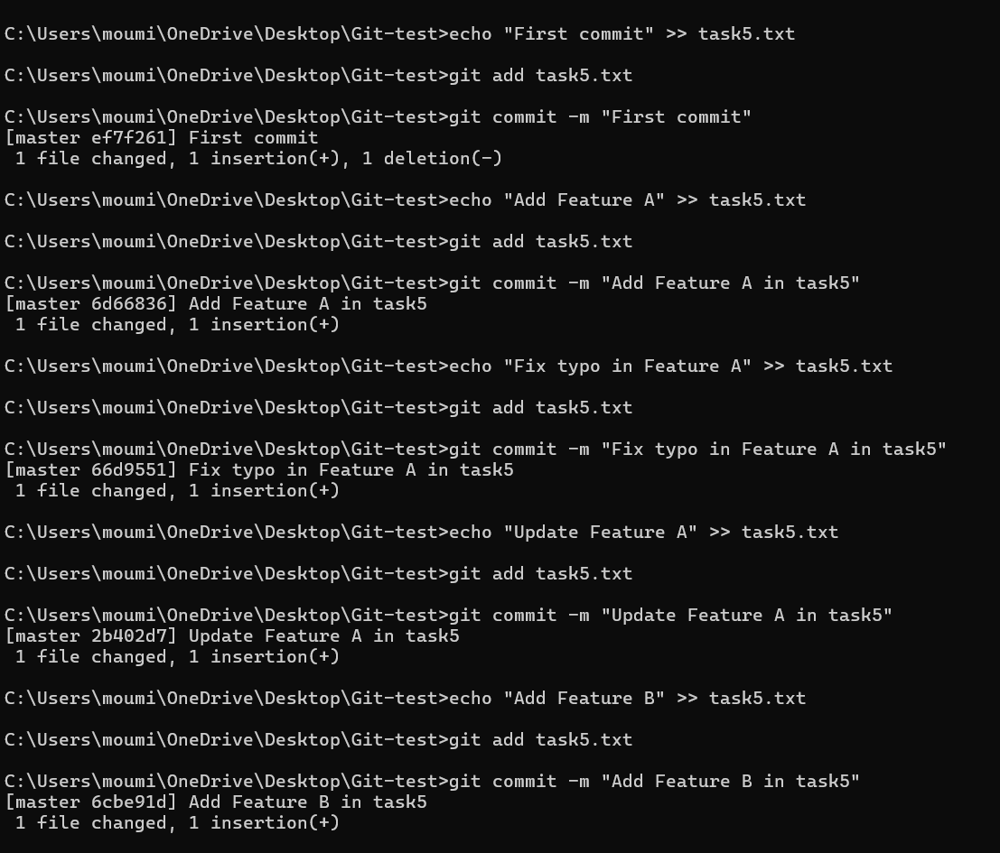
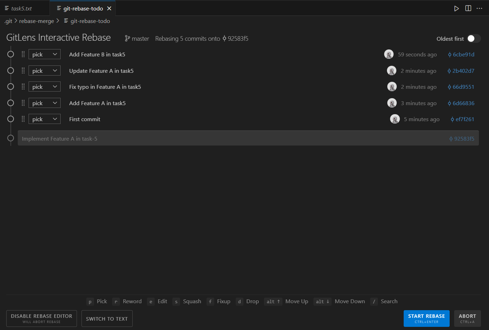
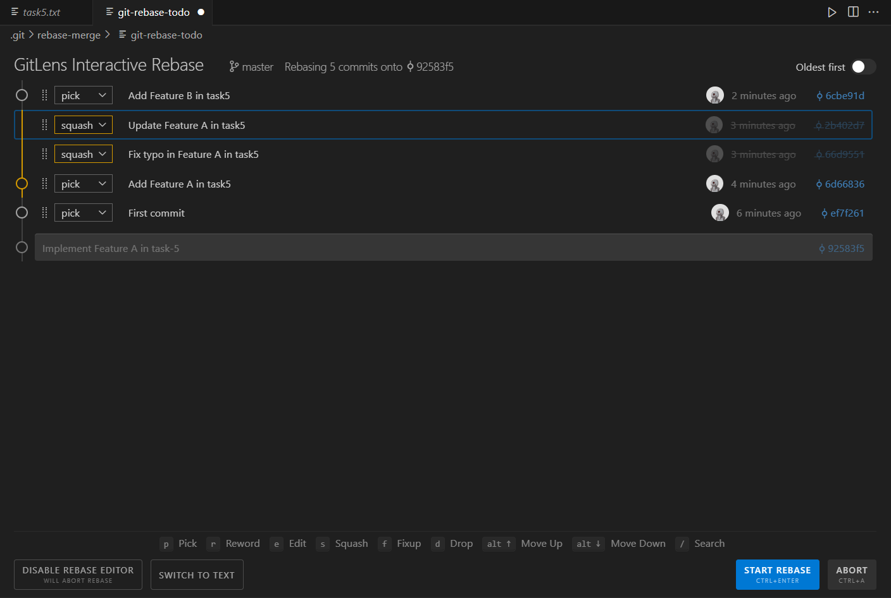
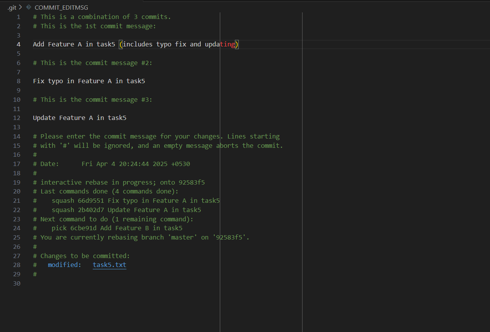
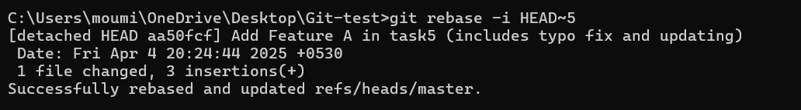
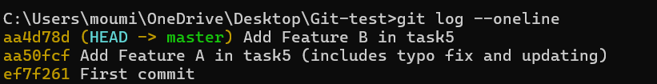

# Task 5 **Interactive Rebasing for Clean Commit History**
    
## **Objective:**
- Use interactive rebase to tidy up your commit history.
    
## **Requirements:**    
- Create a series of commits (some with minor changes or typos in commit messages).
- Run `git rebase -i HEAD~n` (with `n` representing the number of commits) to squash, reorder, and edit commit messages.
- Explain how squashing helps in cleaning up commit history before merging into a main branch.

## **Steps:**

### 1. **Create a Series of Commits**
- First, create a repository and initialize Git using `git init`.
- Create a file and make multiple commits, including minor changes or typos.



### 2. **Run Interactive Rebase**
- The `git rebase` command is used to modify commit history by rearranging, editing, or merging commits.
- Interactive rebasing (`-i`) allows you to pick, squash, edit, or reword commits before applying them.
- Run the following command to start interactive rebase:
 
```sh
git rebase -i HEAD~5
```


- This opens an editor showing the last 5 commits:



### 3. **Modify the Commit History**
- Change `pick` to:
    - `squash` (`s`): Merge a commit into the previous one.
    - `reword` (`r`): Modify the commit message.
    - `edit` (`e`): Modify the commit itself.

- Example (squashing typo fix and update into Feature A commit):



### 4. **Edit the Commit Message**
- After saving, Git will prompt you to modify the commit message. Change it to:

```
Feature A implemented (includes typo fix and refactoring)
```



### 5. **Continue the Rebase**
- If needed, resolve conflicts, then run:
```sh
git rebase --continue
```



### 6. **Verify Clean Commit History**
- Check the commit history after rebasing:
```sh
git log --oneline
```



- It will now look more structured, with fewer unnecessary commits.

## **Why Squashing Helps Before Merging?**
- **Keeps history clean**: Removes unnecessary commits.
- **Enhances readability**: Easier to understand changes.
- **Improves collaboration**: Simplifies code review.
- **Maintains logical commits**: Groups relevant changes together.

- By following these steps, we can ensure that the commit history is well-organized before merging into the main branch.


