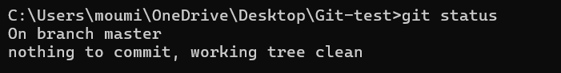
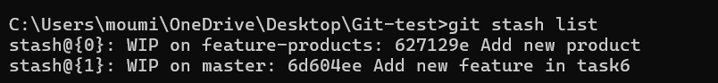
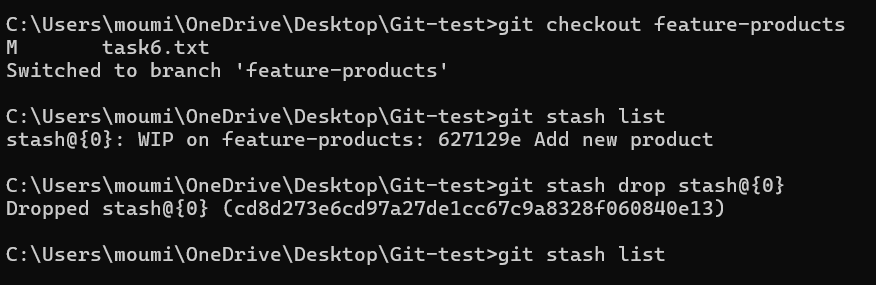

# Task 6: Stashing Changes for Context Switching
    
## **Objective**
- Learn how to use Git stash to save uncommitted work temporarily and restore them later when needed.
    
## **Requirements**    
- Make changes in your working directory without committing.
- Use `git stash` to save these changes.
- Switch branches, perform some work, then return and reapply your stashed changes with `git stash pop`.
- View and manage multiple stashes using `git stash list` and `git stash drop`.

## **Steps**

### 1. Initialize Repository and Create a File
- Create a new file `task6.txt` with initial content.
- Add and commit the file to the repository.


### 2. Modify the File and Stash Changes
- Modify `task6.txt` and check the status.

```sh
git status
```


- Stash uncommitted changes using the command.

```sh
git stash
```


- Verify that the changes are stored using `git stash list`.

```sh
git stash list
```


- Check status after stashing.




### 3. Switch to a New Branch and Work on Another Feature
- Create and switch to a new branch `feature-products`.
- Create and commit a new file `products.txt`.
- Make additional modifications to `products.txt` and stash the changes.


- Verify multiple stashes using `git stash list`.



### 4. Restore Stashed Changes in the Master Branch
- Switch back to the `master` branch.
- Apply and remove a specific stash using `git stash pop`.

```sh
git stash pop stash@{1}
```


- Verify the working directory status after applying the stash.


- Check the updated stash list.


### 5. Remove Remaining Stashed Changes in Feature Branch
- Switch back to `feature-products`.
- Drop the remaining stash using `git stash drop`.
- Verify the stash list is empty.

```sh
git stash drop stash@{0}
```



## **Git Stash Commands:**

### `git stash`
- Saves uncommitted changes in a temporary storage area.
- Leaves the working directory clean.

### `git stash list`
- Displays all stored stashes.

### `git stash pop`
- Applies the most recent stash and removes it from the stash list.
- Can specify a stash using:

  ```sh
  git stash pop stash@{1}
  ```

### `git stash drop`
- Removes a specific stash.
- Example:
  ```sh
  git stash drop stash@{0}
  ```

### `git stash clear`
- Deletes all stashes permanently.
- Use with caution as this action cannot be undone.
