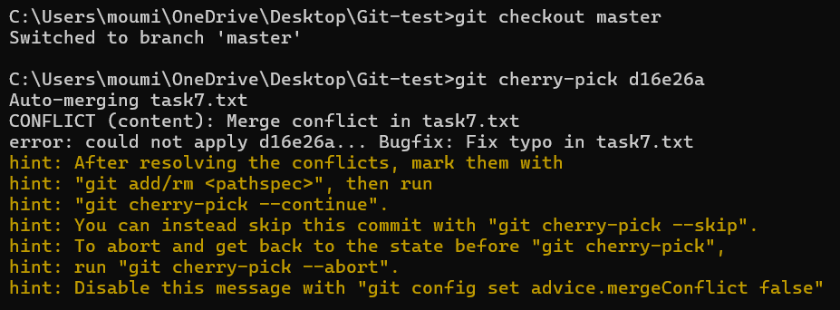
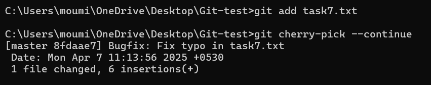

# Task 7 **Cherry-Picking Commits Between Branches**
    
## **Objective:**
- Selectively apply a commit from one branch to another using cherry-pick.
    
## **Requirements:**    
- Create two branches with distinct commits.
- Identify a commit on one branch that you want to apply to the other.
- Use `git cherry-pick <commit-hash>` to apply the commit and handle any conflicts if they arise.
- Verify the commit history to ensure the cherry-picked commit is present.

## **What is Cherry-Pick?**
- git `cherry-pick` is a command used to apply a specific commit from one branch to another, without merging the entire branch.
- It's useful when you want to transfer individual bug fixes or features between branches.

## Steps & Commands Used

### 1. Start with master branch and initial commit:
- Create task7.txt and make initial commit.


### 2. Create new branch feature-cherry and add commits:
- Switch to feature-cherry branch.
- Add multiple commits, including a bugfix.
 


### 3. View log to get commit hash:
```sh
git log --oneline
```


- Copy the hash of the desired commit you want to cherry-pick (e.g., bugfix).

### 4. Switch back to master branch:

```sh
git checkout master
```

### 5.Cherry-pick the bugfix commit from feature-cherry:

```sh
git cherry-pick d16e26a
```



### 6. Resolve Conflict:
- Conflict will occur in task7.txt because the master version is behind the feature branch.


- Open task7.txt, edit manually to resolve:


- Stage the resolved files & continue the cherry-pick process:




### 7. Check if cherry-picked commit is added on master:
```sh
git log --oneline
```


- ***Note:*** Bugfix: Fix typo in task7.txt is now present on master, cherry-picked from feature-cherry.

## **Commands used:**
`git cherry-pick <commit-hash> `
- Applies only that specific commit to your current branch.
- If changes in the cherry-picked commit clash with current files, Git will trigger a conflict.

- If a conflict occurs:
    - Manually edit and fix the conflicted files.
    - Stage the resolved files: `git add <filename>`
    - Continue the cherry-pick process: `git cherry-pick --continue`

`git log --oneline`
-  Shows commit history in a compact format to verify cherry-pick success.

