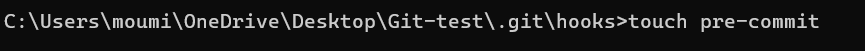
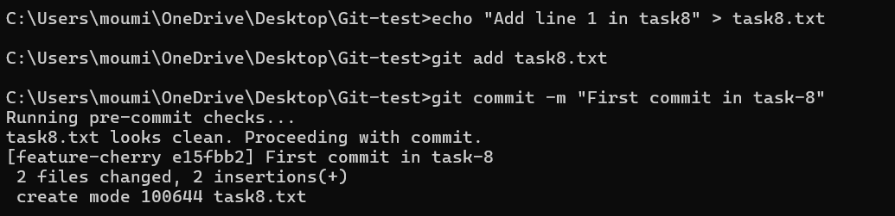

# Task 8 - **Using Git Hooks for Automated Checks**
    
## **Objective:**
- Set up a Git hook to run scripts (like linters or tests) before commits are finalized.
    
## **Requirements:**
- Create a `pre-commit` hook in the `.git/hooks` directory.
- Write a simple script (e.g., a shell script or Node script) that runs a linter or a unit test.
- Ensure that if the tests or linting fail, the commit is aborted.
- Document how Git hooks can improve code quality in collaborative projects.

## **What are Git Hooks?**
- Git hooks are custom scripts that Git automatically executes before or after specific  Git operations like commit, push, or merge.
    - `pre-commit`: Before a commit is finalized.
    - `pre-push`: Before code is pushed to a remote.
    - `commit-msg`: When a commit message is created.

- They are helpful for:
    - Running linters or formatters
    - Checking commit messages
    - Preventing bad code from being committed
    - Enforcing rules in a collaborative environment

## Steps:

#### 1. **Open Git Project & Navigate to Hooks Folder:**
- Git Hooks are located inside the `.git/hooks` folder of your project.
- Git runs scripts in this folder automatically at various points in the Git workflow (like before a commit or after a merge).
- To set up a pre-commit hook, you need to navigate to this directory.
- It contains sample hook scripts (like pre-commit.sample) that can be renamed and used.

```sh
cd path/to/your/git-project
cd .git/hooks
```


#### 2. **Create the pre-commit Hook File:**
```sh
touch pre-commit
```

- This command creates a new file named `pre-commit` in the .git/hooks directory. 
- This is the exact filename Git looks for to run a script before each commit.
- We’ll place our custom logic in this file to automatically check the files before allowing the commit.



#### 3. **Make the Hook Executable:**
```sh
chmod u+x pre-commit
```

- By default, newly created files don’t have executable permissions.
- Running chmod u+x  gives the current user (u) execute (+x) permission on the pre-commit file.
- This is `required`, otherwise, Git won’t run it.


- ***Note:*** Without chmod, Git will silently skip the hook!

#### 4. **Add Bash Script Logic:**
- Open the pre-commit file (You can use any editor)

```sh
code pre-commit
```
- Paste the following code: 
- 
```sh
#!/bin/bash

echo "Running pre-commit checks..."

if [ -f "task8.txt" ]; then
  if grep -qi "error" task8.txt; then
    echo "Commit blocked: 'error' found in task8.txt"
    exit 1
  else
    echo "task8.txt looks clean. Proceeding with commit."
  fi
else
  echo "task8.txt not found. Skipping check."
fi

exit 0
```
- This bash script checks if the file task8.txt exists. If it does, it searches for the word "error" (case-insensitive).
- If "error" is found, the script exits with code 1, blocking the commit.If not, it exits with 0, allowing the commit.
- This is a basic example of a linter or validator using a Git hook.


#### 5. **Go Back to Main Project Directory:**
- After setting up the hook, return to the root directory of your Git project to create files and test the hook.

```sh
cd ../..  # from .git/hooks back to project root
```


#### 6. **Create a File Without "error" word and Commit:**



- Since the file task8.txt does not contain the word "error", the hook allows the commit to proceed normally.

#### 7. **Add a Line With "error" and Try to Commit:**


- This time the script finds the word "error" inside task8.txt, and the commit is blocked.
- This shows that the Git hook is working correctly and helping prevent potentially problematic commits.

## **How Git Hooks Improve Code Quality in Collaborative Projects?**
- Enforce Coding Standards
- Block Broken or Failing Cod
- Catch Mistakes Early
- Prevent Sensitive Data Leaks
- Ensure Team-wide Consistency
- Enforce Commit Message Rules
- Automate Routine Tasks