# Task 9 **Working with Remote Repositories and Collaboration**
    
## **Objective:**
- Simulate a collaborative workflow with remote repositories.

## **Requirements:**
- Create a local repository and push it to a remote service (e.g., GitHub or GitLab).
- Create a feature branch, make commits, and push the branch to the remote.
- Open a Pull Request (or Merge Request) and perform a code review process.
- Merge the feature branch into the main branch on the remote and then pull the changes locally.

## **Steps:**

#### **1. Initialize a Local Git Repository:**
- Initialize the local project folder as a Git repository. 
- This sets up Git to start version control.

```sh
git init
```

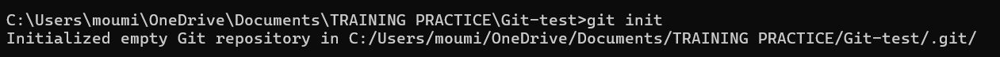

#### **2. Link Remote Repository (GitHub):**
- Connect the local repository to a GitHub remote repository.

```sh
git remote add origin https://github.com/your-name/your-repo-name.git
```
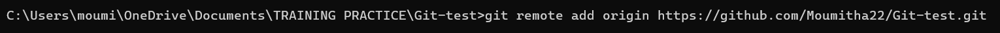

- Verify the connection to the remote:

```sh
git remote -v
```
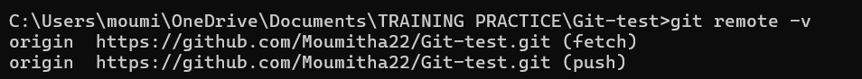

#### **3. Rename Default Branch:**
- Rename the default branch from master to main (as followed by modern Git standards).

```sh
git branch -M main
```

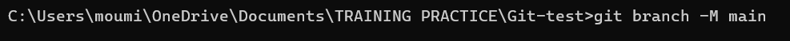

#### **4. Create and Commit the First File:**
- Create an index.html file to represent the homepage.

```sh
touch file_name
```
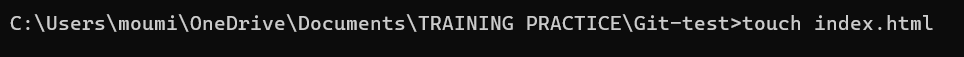

- Add content to the file.
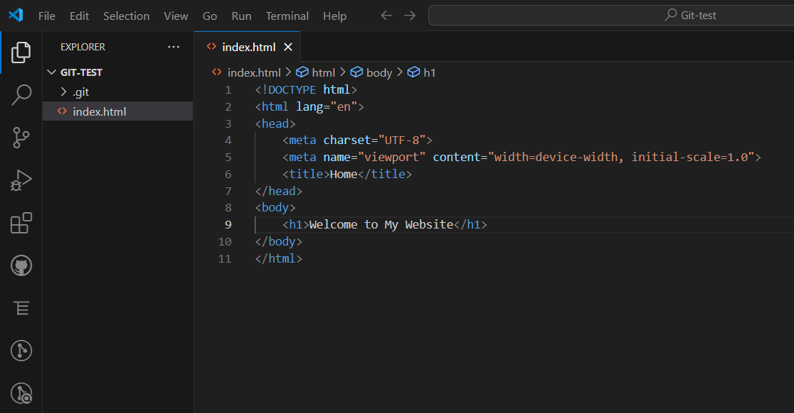

- Stage and commit the file to Git.

```sh
git add file_name
git commit -m "Commit message"
```

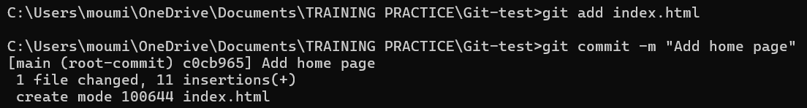

#### **5. Push main Branch to GitHub:**
Push the local main branch to the remote GitHub repository.

```sh
git push -u origin main
```

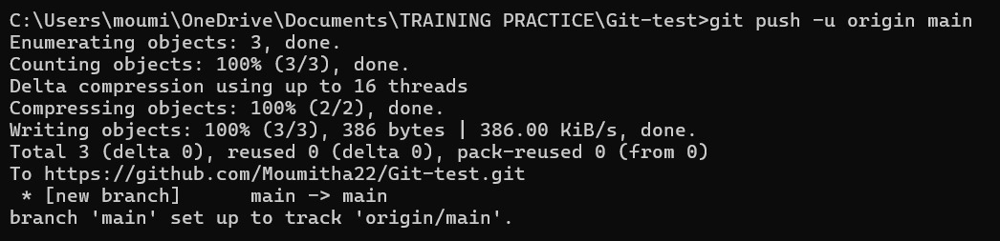

#### **6. Create a New Feature Branch:**
- Create and switch to a new branch for the about page feature.

```sh
git checkout -b feature-about-page
```
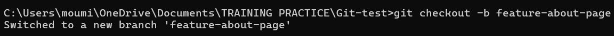

#### **7. Add and Commit New Feature File:**
- Create an about.html file and commit it to the feature branch.

```sh
touch file_name
git add file_name
git commit -m "Commit message"
```

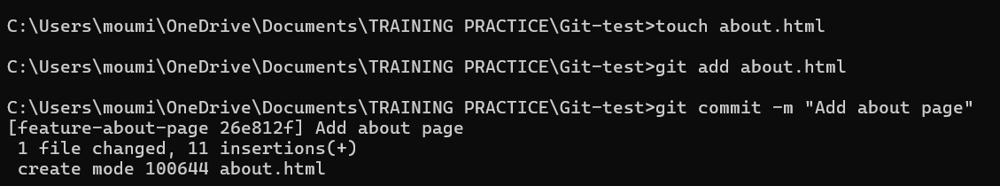

#### **8. Push Feature Branch to Remote:**
- Push the feature branch to the remote GitHub repository.

```sh
git push -u origin feature-about-page
```

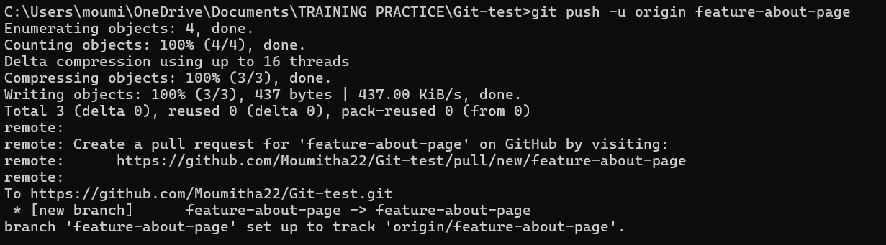

#### **9. Create Pull Request on GitHub:**
- Go to GitHub, click Compare & Pull Request

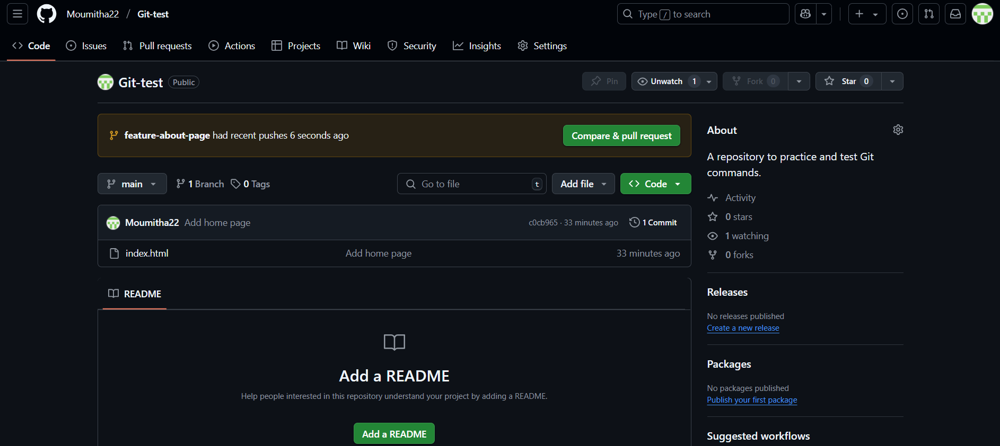

- Add a title and description, then click Create Pull Request.

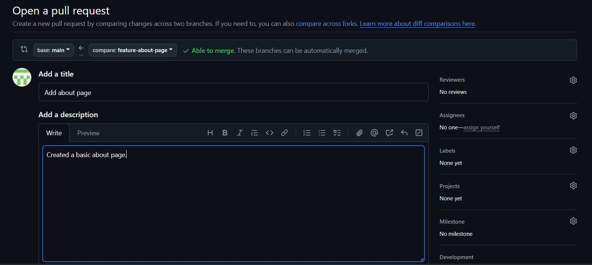


#### **10. Merge Pull Request:**
- Click "Merge Pull Request" to merge the feature-about-page branch into the main branch.

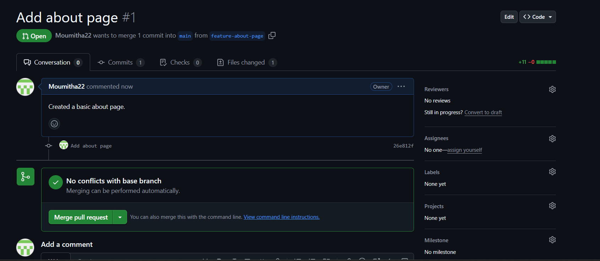

- Confirm the merge operation on GitHub by clicking "Confirm Merge".

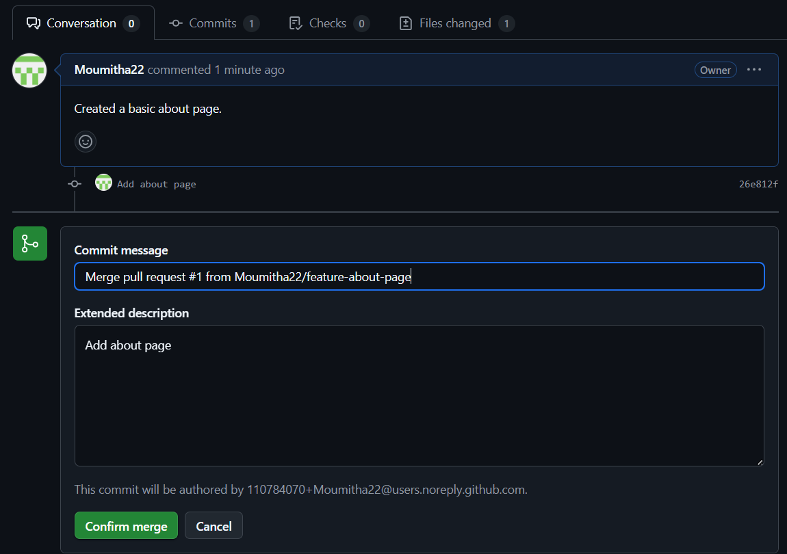

- GitHub shows a success message after the merge is completed.

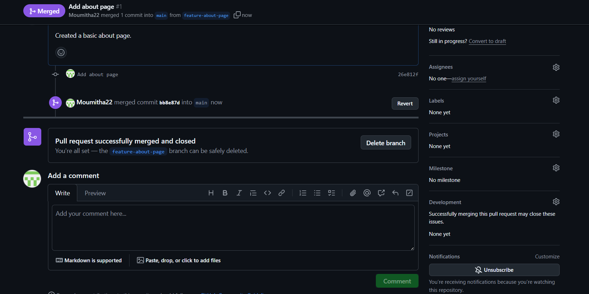

- The main branch now includes the merged changes from feature-about-page.

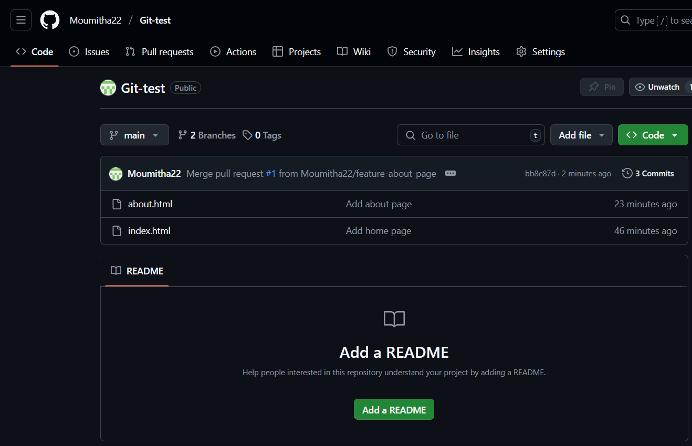

#### **11. Pull Changes to Local Main:**
- Switch to  your local main branch and pull the latest changes from GitHub.

```sh
git checkout main
git pull origin main
```

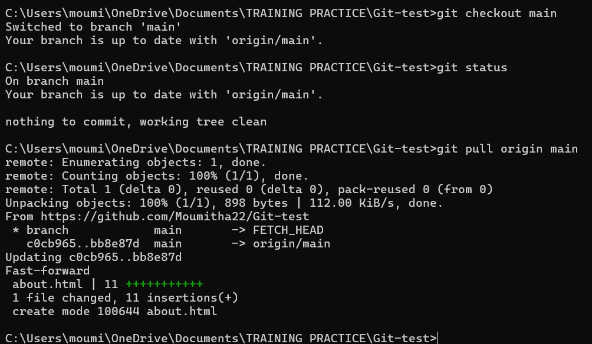